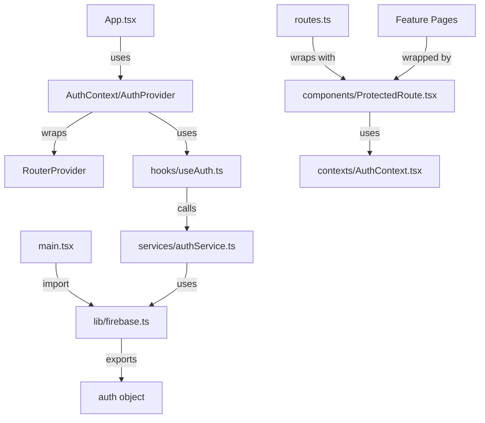

# Firebase Auth - Folder Structure & File Locations

## 📂 Complete Project Structure (Auth-Related Files Highlighted)

```
HR-Ticketing-System/
│
├── src/
│   ├── lib/
│   │   └── firebase.ts ..................... ✅ (Firebase app init, exports auth)
│   │
│   ├── services/
│   │   ├── firestoreService.ts ............ (existing)
│   │   ├── realtimeDbService.ts ........... (existing)
│   │   └── authService.ts ................. ✨ NEW
│   │       │
│   │       ├── loginWithEmailPassword(email, password)
│   │       ├── logout()
│   │       ├── getCurrentUser()
│   │       ├── getUserRole(uid)
│   │       ├── getUserData(uid)
│   │       ├── hasRole(uid, requiredRoles)
│   │       └── mapAuthError(errorCode)
│   │
│   ├── hooks/
│   │   ├── useFirestore.ts ................ (existing)
│   │   ├── useRealtimeDb.ts ............... (existing)
│   │   └── useAuth.ts ..................... ✨ NEW
│   │       │
│   │       └── useAuth() returns:
│   │           ├── user: User | null
│   │           ├── role: UserRole | null
│   │           ├── loading: boolean
│   │           ├── error: string | null
│   │           ├── hasRole(requiredRoles)
│   │           └── isAuthenticated()
│   │
│   ├── scripts/
│   │   └── seedUsers.ts ................... ✨ NEW
│   │       │
│   │       ├── Environment: Must run in Node.js
│   │       ├── Command: npx ts-node src/scripts/seedUsers.ts
│   │       └── Creates:
│   │           ├── admin@company.com (Admin@1234)
│   │           ├── hr@company.com (Hr@1234)
│   │           └── employee@company.com (Employee@1234)
│   │
│   ├── main.tsx ............................. 🔄 UPDATED
│   │   └── Added: import "./lib/firebase"
│   │
│   └── app/
│       ├── App.tsx .......................... ✅ (Already has <AuthProvider>)
│       │
│       ├── contexts/
│       │   ├── AuthContext.tsx ............. 🔄 UPDATED (mock → Firebase)
│       │   │   │
│       │   │   ├── <AuthProvider> component
│       │   │   ├── useAuth() hook
│       │   │   └── AuthContextType:
│       │   │       ├── user, role, loading, error
│       │   │       ├── hasRole(roles)
│       │   │       └── isAuthenticated()
│       │   │
│       │   └── ThemeContext.tsx ........... (existing)
│       │
│       ├── components/
│       │   ├── ProtectedRoute.tsx ......... ✨ NEW
│       │   │   │
│       │   │   ├── Props:
│       │   │   │   ├── children: React.ReactNode
│       │   │   │   └── allowedRoles: UserRole[]
│       │   │   │
│       │   │   ├── Returns:
│       │   │   │   ├── Loading spinner while checking auth
│       │   │   │   ├── Redirects to /login if not authenticated
│       │   │   │   ├── Redirects to /unauthorized if role denied
│       │   │   │   └── Renders children if authorized
│       │   │   │
│       │   │   └── Usage:
│       │   │       <ProtectedRoute allowedRoles={["admin"]}>
│       │   │         <AdminDashboard />
│       │   │       </ProtectedRoute>
│       │   │
│       │   ├── AdminSidebar.tsx ........... (existing)
│       │   ├── EmployeeSidebar.tsx ........ (existing)
│       │   ├── HRSidebar.tsx .............. (existing)
│       │   └── ... (other components unchanged)
│       │
│       ├── features/
│       │   ├── auth/
│       │   │   └── LoginPage.tsx .......... (existing - can be updated)
│       │   ├── employee/
│       │   ├── hr/
│       │   └── admin/
│       │
│       ├── routes.ts ....................... (existing - can be wrapped with ProtectedRoute)
│       │
│       └── pages/
│           ├── LoginPage.tsx
│           ├── AdminDashboard.tsx
│           └── ... (other pages)
│
├── .env (local, not in git) ................. ✅
│   ├── VITE_FIREBASE_API_KEY=...
│   ├── VITE_FIREBASE_AUTH_DOMAIN=...
│   ├── VITE_FIREBASE_PROJECT_ID=...
│   ├── VITE_FIREBASE_STORAGE_BUCKET=...
│   ├── VITE_FIREBASE_MESSAGING_SENDER_ID=...
│   ├── VITE_FIREBASE_APP_ID=...
│   └── VITE_FIREBASE_DATABASE_URL=...
│
├── .env.example (in git) ................... ✅
│   └── Same keys as .env (all empty)
│
├── .gitignore ............................... ✅
│   ├── node_modules
│   ├── .env
│   ├── .env.local
│   └── .env.*.local
│
├── FIREBASE_SETUP.md ....................... (Phase 1: Firestore + Realtime DB)
├── FIREBASE_AUTH_SETUP.md .................. ✨ NEW (Phase 2: Auth + Roles)
├── FIREBASE_AUTH_QUICK_REF.md .............. ✨ NEW (Quick reference)
└── AUTH_INTEGRATION_SUMMARY.md ............. ✨ NEW (Overview)
```

---

## 🔑 File Import Paths

### In React Components

```typescript
// Import useAuth hook from context
import { useAuth } from '../contexts/AuthContext';

// Or use the hook directly (from src/hooks/useAuth.ts)
import { useAuth } from '../hooks/useAuth';
// Note: Prefer the context version since it checks for AuthProvider

// Import ProtectedRoute
import { ProtectedRoute } from '../components/ProtectedRoute';

// Import UserRole type
import { UserRole } from '../services/authService';
```

### In Normal JavaScript/TypeScript

```typescript
// Import auth service outside React components
import { 
  loginWithEmailPassword, 
  logout, 
  getCurrentUser, 
  getUserRole,
  hasRole,
  UserRole 
} from '../services/authService';

// Usage
const user = await loginWithEmailPassword('email@example.com', 'password');
const role = await getUserRole(user.uid);
await logout();
```

### In Tests/Scripts

```typescript
// Same imports as above
import { loginWithEmailPassword, getUserRole } from '../services/authService';
```

---

## 📍 Exact File Locations

### Core Authentication Files

| File | Full Path | Purpose |
|------|-----------|---------|
| Auth Service | `src/services/authService.ts` | Email/password login + role management |
| useAuth Hook | `src/hooks/useAuth.ts` | Auth state hook |
| Auth Context | `src/app/contexts/AuthContext.tsx` | Global auth provider |
| Protected Route | `src/app/components/ProtectedRoute.tsx` | Role-based route protection |
| Seed Script | `src/scripts/seedUsers.ts` | Create test accounts (run once) |

### Configuration Files

| File | Full Path | Purpose |
|------|-----------|---------|
| Firebase Init | `src/lib/firebase.ts` | Firebase app initialization |
| Environment | `.env` | Firebase config (local only) |
| Example Env | `.env.example` | Env template for version control |

### Documentation Files

| File | Full Path | Purpose |
|------|-----------|---------|
| Auth Setup | `FIREBASE_AUTH_SETUP.md` | Complete setup guide |
| Quick Ref | `FIREBASE_AUTH_QUICK_REF.md` | Quick reference |
| Summary | `AUTH_INTEGRATION_SUMMARY.md` | Overview |

---

## 🔗 Import Relationships



---

## 🎯 Component Usage Paths

### Example: AdminDashboard.tsx

```typescript
// AdminDashboard lives at: src/app/pages/AdminDashboard.tsx

import { ProtectedRoute } from '../components/ProtectedRoute';
import { useAuth } from '../contexts/AuthContext';

export const AdminDashboard = () => {
  const { user, role } = useAuth();
  
  return <div>Welcome {user?.email}</div>;
};

// In routes.ts:
import { ProtectedRoute } from './components/ProtectedRoute';
import AdminDashboard from './pages/AdminDashboard';

{
  path: "/admin",
  Component: () => (
    <ProtectedRoute allowedRoles={["admin"]}>
      <AdminDashboard />
    </ProtectedRoute>
  ),
}
```

---

## 📦 Dependencies

### Existing (Already Installed)
- `firebase` (v9+)
- `react` + `react-dom`
- `react-router` / `react-router-dom`
- `typescript`

### For Seed Script (Install Once)
```bash
npm install -D dotenv ts-node
```

---

## 🚀 Setup Sequence

1. **Firebase Console Setup** (one-time)
   - Enable Email/Password auth
   - Deploy security rules

2. **Code Setup** (automatic with files provided)
   - All files already created
   - Import paths already configured
   - AuthProvider already in App.tsx
   - Firebase init already in main.tsx

3. **Data Setup** (one-time)
   - Run seed script: `npx ts-node src/scripts/seedUsers.ts`

4. **Component Updates** (optional)
   - Update LoginPage to use auth service
   - Wrap routes with ProtectedRoute
   - Add logout button to navbar

---

## ✅ Files Status

```
✨ NEW (Ready to use)
  - src/services/authService.ts
  - src/hooks/useAuth.ts
  - src/scripts/seedUsers.ts
  - src/app/components/ProtectedRoute.tsx
  - FIREBASE_AUTH_SETUP.md
  - FIREBASE_AUTH_QUICK_REF.md
  - AUTH_INTEGRATION_SUMMARY.md

🔄 UPDATED (Code added, functionality expanded)
  - src/app/contexts/AuthContext.tsx (mock → Firebase)
  - src/main.tsx (added Firebase import)

✅ UNCHANGED (Already correct, no changes needed)
  - src/lib/firebase.ts (already exports auth)
  - src/app/App.tsx (already has AuthProvider)
  - .env (already has Firebase config)
  - .gitignore (already excludes .env)
```

---

## 🎓 How Everything Connects

```
1. User logs in via LoginPage
   ↓
2. LoginPage calls loginWithEmailPassword() from authService
   ↓
3. Firebase authenticates and returns User
   ↓
4. useAuth hook in AuthProvider fetches role from Firestore
   ↓
5. AuthContext provides user + role globally
   ↓
6. ProtectedRoute checks role and redirects if needed
   ↓
7. Component receives authenticated user + role
   ↓
8. Component renders with role-based content
```

---

## 📝 File Sizes & Complexity

| File | Lines | Complexity |
|------|-------|-----------|
| authService.ts | ~140 | Simple (straightforward Firebase calls) |
| useAuth.ts | ~110 | Medium (listener setup, error handling) |
| AuthContext.tsx | ~60 | Simple (context wrapper) |
| ProtectedRoute.tsx | ~60 | Simple (redirect logic) |
| seedUsers.ts | ~140 | Medium (error handling for existing users) |

---

## 🔐 Security Checks

```
✓ No credentials in code (all in .env)
✓ .env in .gitignore
✓ Passwords hashed by Firebase
✓ HTTPS enforced by Firebase
✓ Roles verified server-side by Firestore Rules
✓ User can only access own data
✓ Admin has elevated privileges
✓ TypeScript prevents type mistakes
```

---

## 🆘 Finding Files When Needed

If you need to update LoginPage:
```
src/app/features/auth/LoginPage.tsx
```

If you need to add a new protected route:
```
src/app/routes.ts
```

If you need to update security rules:
```
Firebase Console → Firestore Database → Rules
```

If you need to run the seed script:
```bash
npx ts-node src/scripts/seedUsers.ts
```

If you need to use auth in a component:
```typescript
import { useAuth } from '../contexts/AuthContext';
```

If you need auth service outside React:
```typescript
import { loginWithEmailPassword } from '../services/authService';
```
